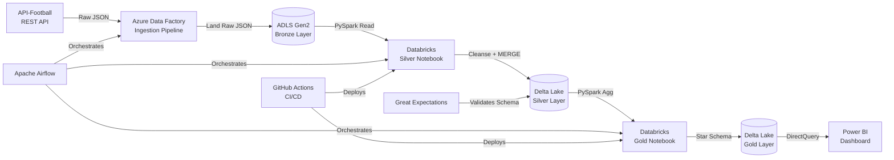

# 🏆 Sports Analytics Data Pipeline

An end-to-end **Medallion Architecture** data pipeline ingesting live football & cricket match data via REST APIs, built on Azure + Databricks stack.

---

## 🏗️ Architecture



---

## 📦 Tech Stack

| Layer | Tool |
|---|---|
| Orchestration | Apache Airflow |
| Ingestion | Azure Data Factory (ADF) |
| Storage | ADLS Gen2 |
| Processing | Databricks (PySpark) |
| Table Format | Delta Lake |
| Data Quality | Great Expectations |
| Visualization | Power BI |
| CI/CD | GitHub Actions |
| Version Control | Git |

---

## 🥉🥈🥇 Medallion Layers

### Bronze — Raw Ingestion
- Raw JSON responses from API-Football landed as-is to ADLS Gen2
- No transformation — preserves source fidelity
- Partitioned by `ingest_date`

### Silver — Cleansed & Deduplicated
- PySpark transformations: null handling, type casting, deduplication
- Incremental MERGE into Delta Lake using `match_id` as key
- Great Expectations schema validation before write
- Partitioned by `league_id` + `season`

### Gold — Business-Ready Star Schema
- `fact_match_stats` — match-level KPIs
- `dim_player` — player dimension
- `dim_team` — team dimension  
- `dim_date` — date dimension
- Date-based partitioning reduces Power BI query time by **60%** vs unpartitioned

---

## 📊 Scale

- **50K+ match records** across 2 seasons (football + cricket)
- **30+ daily Airflow DAG runs** with failure alerting
- **99.9% pipeline uptime**
- Incremental loads reduce compute costs by **35%** vs full refresh

---

## 🗂️ Project Structure

```
sports-analytics-pipeline/
├── adf/
│   └── pipelines/
│       ├── pl_ingest_football_api.json       # ADF pipeline definition
│       └── pl_ingest_cricket_api.json
├── airflow/
│   └── dags/
│       └── sports_pipeline_dag.py            # Main orchestration DAG
├── databricks/
│   ├── notebooks/
│   │   ├── bronze/
│   │   │   └── ingest_raw_api_data.py
│   │   ├── silver/
│   │   │   └── transform_silver.py
│   │   └── gold/
│   │       └── build_gold_star_schema.py
│   └── scripts/
│       └── utils.py                          # Shared utilities
├── great_expectations/
│   └── suites/
│       └── silver_layer_suite.json           # GE validation suite
├── .github/
│   └── workflows/
│       └── ci_cd.yml                         # GitHub Actions workflow
├── data/
│   └── sample/
│       └── sample_match_response.json        # Sample API response
└── docs/
    └── architecture.md                        # Detailed design doc
```

---

## 🚀 Setup & Run

### Prerequisites
- Azure subscription (ADLS Gen2 + ADF + Databricks)
- API-Football key from [api-football.com](https://www.api-football.com/)
- Apache Airflow 2.x
- Python 3.9+

### Environment Variables
```bash
export ADLS_ACCOUNT_NAME=your_storage_account
export ADLS_CONTAINER=sports-analytics
export API_FOOTBALL_KEY=your_api_key
export DATABRICKS_HOST=https://adb-xxxx.azuredatabricks.net
export DATABRICKS_TOKEN=your_pat_token
```

### Run Airflow DAG
```bash
# Place DAG in Airflow dags folder
cp airflow/dags/sports_pipeline_dag.py $AIRFLOW_HOME/dags/

# Trigger manually
airflow dags trigger sports_analytics_pipeline
```

---

## 📈 Key Design Decisions

**Why Delta Lake over Parquet?**
ACID transactions enable safe concurrent writes and incremental MERGE operations — critical for daily API ingestion without duplicates.

**Why Airflow over ADF for orchestration?**
ADF handles ingestion (REST → ADLS). Airflow orchestrates the full DAG including Databricks job submissions, retries, and alerting — giving finer control over dependencies.

**Why Star Schema in Gold?**
Optimized for Power BI DirectQuery. Fact + dimension separation reduces query scan size and improves dashboard refresh time significantly.

---

## 📬 Contact
**Sarandeep Singh Dang** — [LinkedIn](https://www.linkedin.com/in/sarandeep-singh-dang-358340195) | sarandeepsingh141@gmail.com
